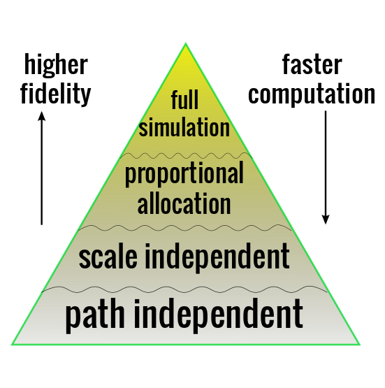

## My background

* Former applied mathematician. (IUB graduate!)
* Quant Programmer & Quant Strategist 2007-2015 at 
two small hedge funds.
* Almost pure quant funds, ML-based, in U.S. ("single name") equities and
volatility futures.
* Tried many ML technologies to construct strategies: SVM, random forests, 
GP.
* Also traditional statistical approaches: plain old regression.
* Whatever the approach, we used _backtests_. (GP used them heavily.)

--- .class #backtests

## Backtests

### What makes a profitable strategy?

* Need prediction of future price movements.

But also:

* Turn predictions into trades.
* Really, turn predictions into trades.
* Eliminate or reduce exposure to certain risks.
* Control trade costs. (commissions, short financing, market impact.)

Hard to estimate the effects of the different moving parts separately, so
simulate your trading historically. A backtest.

Backtesting goes hand in hand with quantitative strategies: you cannot backtest
discretionary trading.

--- .class #kindsof

## Different kinds of backtests





--- .class #fooz

## foo


```r
x <- runif(100)
```

Equations:

$$
x = \sum_{0 \le i \le 100} i^2
$$


